Conditional Variational Autoencoder Toy Example
============

This is an implementation of a conditional variational autoencoder in Keras. It is designed to regress a green rectangle from small images containing two possible different shapes. It borrows from code found in https://github.com/nnormandin/Conditional_VAE, which is similar but based on the MNIST dataset. The goal of this is to test the efficacy of VAEs in regressing out arbitrary features of an image in an easily-verifiable way before applying the framework to more complex projects.

The script contains code to generate and save 32x32 images that each have a 50% chance of containing a red ellipse and a 50% chance of containing a green rectangle, each of varying height and width (though height and width variations are only really apparent at large image dimensions -- in the current script settings they are essentially all the same). So, 25% of the generated images are just blank white images, and 25% contain both objects. The CVAE takes, as input, the images, as well as 10 labels that encode all information about the image (two numbers indicating the presence of each shape, four indicating the coordinates of each shape, and four indicating the height and width of each shape). This project shows the results of setting the input label for the green rectangle from one to zero. The goal of this is to use a CVAE to regress out the green rectangle and leave the red ellipse unaffected.

The script main.py should do everything, including generation of the graphs of the latent space and sample GIF outputs, as well as saving the intermediate model.

The following Python dependencies are required:

  * Keras
  * Tensorflow
  * PIL
  * Numpy
  * imageio
  * matplotlib

Some results visualized are as follows. The training set consisted of 59000 images and the test set 1000. In the three-latticed image, the image to the left is the input, the middle image is the prediction with correct labels in place, and the image to the right is the input with a false bit indicating that the green rectangle is not present. The GIF shows training every 100 epochs, while the still image shows the final output. If the network performs correctly, it should remove the green rectangle (if it is present) and leave the rest of the image unaffected.

Empty image:

<kbd>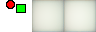</kbd>
<kbd>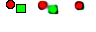</kbd>

Rectangle and ellipse:

<kbd></kbd> 
<kbd>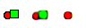</kbd> 

<kbd>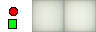</kbd> 
<kbd></kbd> 

<kbd></kbd> 
<kbd>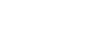</kbd> 

<kbd>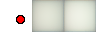</kbd> 
<kbd></kbd> 

Just rectangle:

<kbd></kbd> 
<kbd></kbd> 

<kbd></kbd> 
<kbd></kbd> 

<kbd>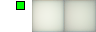</kbd> 
<kbd>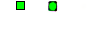</kbd> 

<kbd></kbd> 
<kbd></kbd> 

<kbd></kbd> 
<kbd>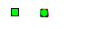</kbd> 

<kbd></kbd> 
<kbd>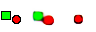</kbd> 

<kbd></kbd> 
<kbd></kbd> 

<kbd></kbd> 
<kbd>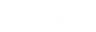</kbd> 

Just ellipse:

<kbd></kbd> 
<kbd></kbd> 

<kbd></kbd> 
<kbd>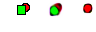</kbd> 

Evolution of the latent space on the test set:

<kbd>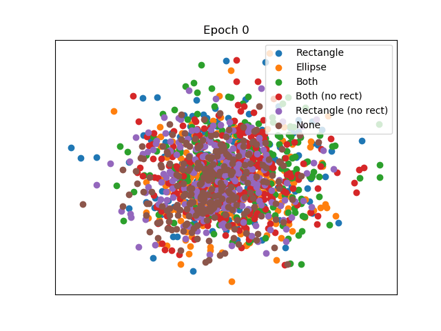</kbd> 
<kbd></kbd> 

Lessons learned from this project:

  * CVAEs will completely ignore the input labels if the dimensionality of the latent space is too high. I initially tried -- and became very, very frustrated by -- this fact when I set the latent space (n_z in the script) to really high dimensions, like 256 or even 64. It turns out that setting it to 2 did the trick. To be honest I didn't really understand variational autoencoders, or the idea of the latent space, before trying this, and it made little sense to me that 2 dimensions was all that was really needed to get it to work halfway decently.
  * The CVAE is pretty effective at removing green rectangles, but what it replaces them with is anyone's guess. I would like it to replace it with a white background, but I think the network assumed that a red ellipse could just be hiding behind it instead. This is mitigated a little bit when labels about the red ellipses is included, but if you think about it, the idea that green rectangles are just blocking red ellipses is a legitimate assumption by the network either way. The code as it is is designed to place green rectangles in front of red ellipses. It's an interesting effect to observe. This issue can also be seen in the latent space plot: the purple dots, which represent removed rectangles, are nearer to their counterparts than they are to the white image, which is represented by the brown cluster. Ideally, there should be a way to push the purple dots closer to the brown cluster, but I can't really think of a way to force the model to do that.

See also:
  * https://wiseodd.github.io/techblog/2016/12/17/conditional-vae/
  * https://github.com/nnormandin/Conditional_VAE
