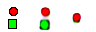
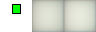
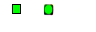
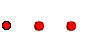
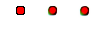

Conditional Variational Autoencoder Toy Example
============

This is an implementation of a conditional variational autoencoder in Keras. It is designed to regress a green rectangle from small images containing two possible different shapes. It borrows from code found in https://github.com/nnormandin/Conditional_VAE, which is similar but based on the MNIST dataset. The goal of this is to test the efficacy of VAEs in regressing out arbitrary features of an image in an easily-verifiable way before applying the framework to more complex projects.

The script contains code to generate and save 32x32 images that each have a 50% chance of containing a red ellipse and a 50% chance of containing a green rectangle, each of varying height and width (though height and width variations are only really apparent at large image dimensions -- in the current script settings they are essentially all the same). So, 25% of the generated images are just blank white images, and 25% contain both objects. The CVAE takes, as input, the images, as well as 10 labels that encode all information about the image (two numbers indicating the presence of each shape, four indicating the coordinates of each shape, and four indicating the height and width of each shape). This project shows the results of setting the input label for the green rectangle from one to zero. The goal of this is to use a CVAE to regress out the green rectangle and leave the red ellipse unaffected.

The script main.py should do everything, including generation of the graphs of the latent space and sample GIF outputs, as well as saving the intermediate model.

The following Python dependencies are required:

  * Keras
  * Tensorflow
  * PIL
  * Numpy
  * imageio
  * matplotlib

Some results visualized are as follows. The training set consisted of 59000 images and the test set 1000. In the three-latticed image, the image to the left is the input, the middle image is the prediction with correct labels in place, and the image to the right is the input with a false bit indicating that the green rectangle is not present. The GIF shows training every 100 epochs, while the still image shows the final output. If the network performs correctly, it should remove the green rectangle (if it is present) and leave the rest of the image unaffected.

Empty image:

<kbd></kbd>
<kbd></kbd>

Rectangle and ellipse:

<kbd></kbd> 
<kbd></kbd> 

<kbd></kbd> 
<kbd></kbd> 

<kbd></kbd> 
<kbd></kbd> 

<kbd></kbd> 
<kbd></kbd> 

Just rectangle:

<kbd></kbd> 
<kbd></kbd> 

<kbd></kbd> 
<kbd></kbd> 

<kbd></kbd> 
<kbd></kbd> 

Just ellipse:

<kbd></kbd> 
<kbd></kbd> 

<kbd></kbd> 
<kbd></kbd> 

<kbd></kbd> 
<kbd></kbd> 

Evolution of the latent space on the test set:

<kbd></kbd> 
<kbd></kbd> 

See also:
  * https://wiseodd.github.io/techblog/2016/12/17/conditional-vae/
  * https://github.com/nnormandin/Conditional_VAE
